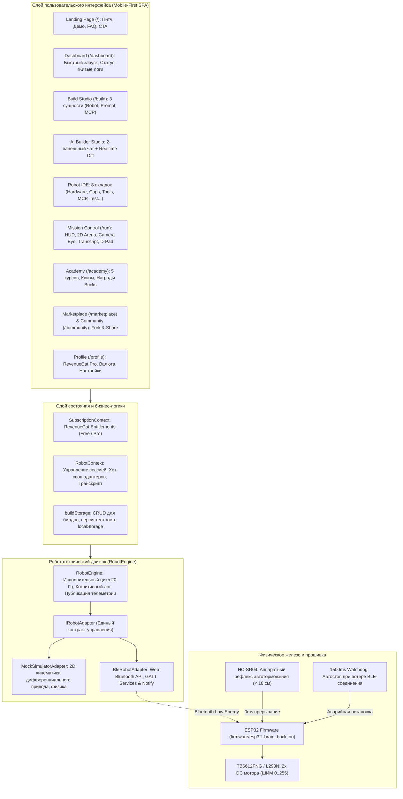

# Brain Brick — Полная архитектура платформы и Посуточный план (9–30 сентября 2026)

**Создатель:** Бекнур (15 лет, Астана, Казахстан)  
**Номинация:** RevenueCat Shipathon 2026 — Next Gen Award  
**Целевой дедлайн:** 30 сентября 2026  
**Стек:** React 19 + TypeScript + Vite + Tailwind CSS v4 + Web Bluetooth + Capacitor + RevenueCat + ESP32 C++ (BLE) + Multimodal Vision AI (Gemini Flash) + MCP (Model Context Protocol)

---

## 1. Детальная архитектура: Что есть прямо сейчас (Current State)



### 1.1 Что уже реализовано на 100%:
1. **Единый Creative Workspace (`/build`)**:
   - Управление 3 сущностями: **Robot Builds** (полные роботы), **Prompt Builds** (системные директивы ИИ), **MCP Tool Builds** (кастомные инструменты).
   - Интерактивный **AI Builder Studio** с 2 панелями: слева диалог с ИИ, справа динамический Diff с подсветкой изменений и кнопкой применения.
   - 8-вкладочный редактор робота: Overview, Hardware (пины, моторы, сонары), Capabilities (Vision, Obstacle Avoidance и др.), Tools, MCP, Prompt, Variables, Test (5-шаговый визуальный пайплайн проверки).
   - Специализированные редакторы **PromptBuildEditor** и **MCPToolEditor** с песочницами.
2. **Mission Control Cockpit (`/run`)**:
   - 2D Canvas Arena с физикой на 20 Гц, конусом обзора камеры ($\pm 35^\circ$), лазерным трекингом цели, препятствиями и перетаскиваемым красным кубиком.
   - Подключение камеры смартфона (`facingMode: "environment"`).
   - Строгий **Live Transcript (Раздел 15 спеки)**: `👤 You` $\to$ `🧠 AI Decision` $\to$ `🛠️ Tool Call` $\to$ `📥 Tool Result` $\to$ `🤖 Robot Actuation`.
   - Голосовая озвучка решений робота через Web Speech API.
   - Кнопка аварийного торможения **HALT** и виртуальный D-Pad.
   - **Хот-своп тумблер**: мгновенное переключение `[ Simulator | 🔵 BLE ESP32 ]` на лету.
3. **Bluetooth BLE и C++ Прошивка**:
   - `src/engine/bleAdapter.ts`: Полная реализация `IRobotAdapter` через стандартный Web Bluetooth API с GATT UUIDs для записи команд и чтения телеметрии (20 Гц).
   - `firmware/esp32_brain_brick.ino`: Готовая прошивка для ESP32 с драйвером моторов TB6612FNG/L298N, аппаратным рефлексом сонара HC-SR04 (<18 см) и сторожевым таймером (1500 мс).
4. **Экосистема, Обучение и Монетизация**:
   - **Robotics Academy (`/academy`)**: 5 категорий курсов с интерактивными квизами и начислением валюты **Bricks 🧱**.
   - **Community Hub (`/community`)**: Лента проектов, лайки, комментарии, кнопка **"Fork Build"**.
   - **Marketplace (`/marketplace`)**: Каталог готовых роботов и тулов за Bricks.
   - **RevenueCat Integration (`/profile`)**: Подписка Pro, управление тикетами, симуляция покупки, аналитика Creator Earnings.

---

## 2. Что в планах (To-Be: Road to Shipathon)

Чтобы проект выиграл **Next Gen Award** на Shipathon 2026, нам нужно добавить три ключевые вещи:

1. **Реальный Vision AI Loop (Gemini Flash API)**:
   - В симуляторе сейчас работает эмулятор зрительного детектора.
   - В режиме камеры: захват снимка из `<video>` раз в 500-1000 мс $\to$ отправка Base64 кадра в Gemini 2.5 Flash API $\to$ получение структурированного Tool Call (`detect_object` / `robot_move_direction`) $\to$ выполнение по BLE.
2. **Упаковка в мобильный APK (Capacitor)**:
   - Сборка Android APK для смартфона через `@capacitor/android` и `@capacitor-community/bluetooth-le`.
   - Это превращает веб-приложение в полноценное нативное мобильное приложение с плавными 60 FPS, полноэкранным интерфейсом и прямым доступом к Bluetooth.
3. **Физический прототип и 90-секундное демо-видео**:
   - Сборка машинки за $25 (ESP32 + 2 мотора + сонар + батарейки).
   - Смартфон на скотче или креплении на машинке.
   - Видео: Бекнур в Астане говорит телефону: *"Найди красный кубик!"*, ИИ анализирует картинку, крутит колеса робота, робот подъезжает к кубику и останавливается в 20 см!

---

## 3. Посуточный календарный план (9 – 30 сентября 2026)

У нас есть **22 дня**. План разбит на 3 спринта:

```
[9 - 14 сентября: Спринт 1]   --> Реальный Vision AI + Capacitor Android APK
[15 - 22 сентября: Спринт 2]  --> Физическая сборка ESP32 + Тест BLE на колесах
[23 - 30 сентября: Спринт 3]  --> Paywall полировка + Съемка 90s видео + Сабмит
```

---

### Спринт 1: Интеллект зрения и Мобильная сборка (9 – 14 сентября)

#### 📅 Среда, 9 сентября: Gemini Multimodal Vision Service
- Создать `src/services/geminiVisionService.ts` с поддержкой API ключа.
- Реализовать метод `analyzeFrame(imageBlob, buildPrompt, toolsSchema)`.
- Поддержка ответа со structured tool calls (вызовы `robot_move_direction`, `robot_turn_to_heading`, `look_at_object`).

#### 📅 Четверг, 10 сентября: Интеграция Vision Loop в RunPage
- В режиме `viewportMode === "camera"` добавить периодический захват кадра с canvas (`canvas.toBlob()`).
- Передача кадра в `geminiVisionService`.
- Автоматический маппинг вызова инструмента в `robotEngine.executeTool()`.
- Вывод обнаруженных bounding boxes поверх превью камеры.

#### 📅 Пятница, 11 сентября: Capacitor Android Setup
- Инициализировать Capacitor в проекте (`@capacitor/core`, `@capacitor/cli`, `@capacitor/android`).
- Настроить `capacitor.config.ts` (App ID: `com.brainbrick.app`, App Name: `Brain Brick`).
- Добавить разрешения в `AndroidManifest.xml` (Камера, Bluetooth Scan, Bluetooth Connect, Fine Location).

#### 📅 Суббота, 12 сентября: Native BLE Plugin для Capacitor
- Добавить `@capacitor-community/bluetooth-le` в `bleAdapter.ts`.
- Сделать прозрачный fallback: если приложение запущено в браузере Chrome — используется Web Bluetooth; если внутри Capacitor на Android — нативный BLE плагин.

#### 📅 Воскресенье, 13 сентября: RevenueCat Native SDK Check
- Проверить `@revenuecat/purchases-capacitor` в нативной сборке.
- Настроить красивый Native Paywall Modal с планом Pro ($4.99/mo) и кнопкой восстановления покупок.

#### 📅 Понедельник, 14 сентября: Тестовый билд первого APK
- Запустить `npm run build` $\to$ `npx cap sync android`.
- Собрать debug APK (`brain-brick-debug.apk`).
- Установить на телефон, проверить работу интерфейса в полный экран.

---

### Спринт 2: Физическое шасси и Реальные тесты (15 – 22 сентября)

#### 📅 Вторник, 15 сентября: Закупка / Подготовка компонентов
- Найти/купить в Астане (в робототехнических магазинах или заказать с Kaspi/AliExpress):
  - Плата ESP32 (30 pin)
  - Драйвер моторов L298N или TB6612FNG
  - 2WD шасси с моторами
  - Ультразвуковой сонар HC-SR04
  - Батарейный отсек 18650 x 2 (или пауэрбанк)

#### 📅 Среда, 16 сентября: Прошивка ESP32
- Установить Arduino IDE или VSCode + PlatformIO.
- Открыть `firmware/esp32_brain_brick.ino`.
- Выбрать плату `ESP32 Dev Module`.
- Загрузить скетч в плату по Micro-USB / Type-C.
- Открыть Serial Monitor (115200 бод), убедиться, что выводится `Brain Brick BLE Firmware Ready!`.

#### 📅 Четверг, 17 сентября: Первое сопряжение по Bluetooth
- Открыть Brain Brick на телефоне или в Chrome ноутбука.
- В шапке выбрать `BLE ESP32` $\to$ Нажать `Connect Link`.
- Выбрать устройство `BrainBrick-Robot`.
- Проверить отклик: в Serial Monitor должно появиться `Client connected!`.

#### 📅 Пятница, 18 сентября: Сборка шасси и подключение проводов
- Закрепить плату ESP32 и драйвер моторов на шасси с помощью винтов или двустороннего скотча.
- Подключить провода по таблице распиновки:
  - Левый мотор $\to$ пины 25, 26, 27.
  - Правый мотор $\to$ пины 14, 12, 13.
  - Сонар $\to$ пины 5, 18.
- Закрепить держатель для телефона спереди робота.

#### 📅 Суббота, 19 сентября: Ручной тест D-Pad
- Поставить робота на колеса (или приподнять на коробку для безопасности).
- Нажать стрелку "Вперед" в приложении $\to$ проверить вращение колес.
- Нажать стрелку "Влево" $\to$ проверить разворот на месте.
- Нажать **HALT** $\to$ мгновенная остановка.

#### 📅 Воскресенье, 20 сентября: Проверка безопасности (Рефлекс и Watchdog)
- Поднести ладонь к датчику HC-SR04 ближе 18 см $\to$ убедиться, что контроллер сам блокирует моторы.
- Отойти на 10 метров или выключить Bluetooth на телефоне $\to$ убедиться, что через 1.5 секунды сработал Watchdog и робот остановился.

#### 📅 Понедельник, 21 сентября: Тест поиска объекта в комнате
- Положить на пол красный мячик или кубик.
- Закрепить телефон на роботе, включить камеру.
- Сказать роботу: *"Find the red cube"*.
- Пронаблюдать, как робот поворачивается, находит кубик камерой, делает вызов тула и подъезжает к нему.

#### 📅 Вторник, 22 сентября: Калибровка параметров скорости
- Настроить переменные билда в IDE (`max_speed`, `turn_duration_ms`).
- Добиться плавного движения без рывков.

---

### Спринт 3: Полировка, Видео и Сабмит (23 – 30 сентября)

#### 📅 Среда, 23 сентября: Полировка RevenueCat Paywall
- Добавить экран сравнения возможностей Free vs Pro в профиле.
- Интегрировать красивый бейдж *"PRO PILOT"* в шапку и профиль.
- Проверить обработку успешной покупки и восстановление подписки.

#### 📅 Четверг, 24 сентября: Доработка контента Academy
- Добавить урок по подключению физического робота ("Lesson 6: Connecting Physical ESP32 via BLE").
- Добавить квиз с наградой в 250 Bricks за понимание GATT-протокола.

#### 📅 Пятница, 25 сентября: Сценарий для 90-секундного демо-ролика
- **0:00 - 0:15 (Хук & Проблема)**: "Привет, я Бекнур, мне 15 лет, я из Астаны. Создавать роботов сегодня — это адски сложно: нужно паять, писать драйверы, ROS2 и часами дебажить код. Мы создали Brain Brick."
- **0:15 - 0:40 (AI Builder & Спека)**: "Вы просто говорите идею голосом: 'Сделай робота, который найдет красный куб'. Наш AI строит архитектуру, тулы и промпт."
- **0:40 - 1:10 (Живое демо с ESP32 и камерой)**: "Я креплю телефон на машинку за $25 с ESP32, подключаюсь по BLE. Камера видит кубик, модель вызывает MCP-тулы, и робот сам едет к цели!"
- **1:10 - 1:25 (Экосистема & RevenueCat)**: "У нас есть симулятор, Академия, Маркетплейс и подписка Pro через RevenueCat."
- **1:25 - 1:30 (Финал)**: "Brain Brick — будущее робототехники в кармане каждого подростка."

#### 📅 Суббота, 26 сентября: Съемка видеоматериала
- Записать скринкаст экрана телефона (интерфейс, красивый симулятор, AI Builder).
- Снять на камеру самого себя и реального робота, двигающегося по комнате.

#### 📅 Воскресенье, 27 сентября: Монтаж видео
- Смонтировать динамичный ролик на 90 секунд (CapCut / Premiere).
- Добавить субтитры на английском языке (жюри Shipathon оценивает на английском).

#### 📅 Понедельник, 28 сентября: Оформление репозитория GitHub
- Оформить `README.md` с бейджами, скриншотами, схемой архитектуры и ссылкой на видео.
- Добавить инструкцию по быстрой сборке: `npm install && npm run build`.
- Прикрепить схему распиновки ESP32.

#### 📅 Вторник, 29 сентября: Генеральный прогон и проверка критериев жюри
- Проверить критерии оценки RevenueCat Shipathon:
  - *Ship Quality* (качество продукта): 5/5
  - *RevenueCat Integration* (подписки, пейволл): 5/5
  - *Innovation / "Next Gen" Factor* (ИИ-робототехника от 15-летнего фаундера): 5/5
  - *Presentation*: 90s видео готово.

#### 📅 Среда, 30 сентября: Сабмит заявки на Shipathon 2026 🎉
- Заполнить форму подачи заявки на официальном сайте Shipathon 2026.
- Прикрепить ссылку на репозиторий, демо-видео и APK.
- Успешный финиш до дедлайна!
