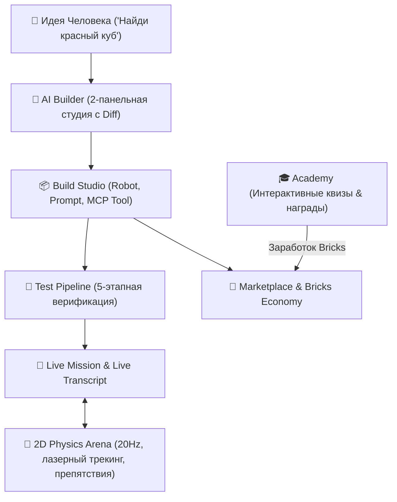

# OmniBrick — Complete Platform Walkthrough (Shipathon 2026 Edition)

> **Creator:** Beknur (15 y.o., Astana, Kazakhstan)  
> **Event:** RevenueCat Shipathon 2026 (Next Gen Award)  
> **Repository Directory:** `C:\Users\Beknur\projects\omnibrick-by-antigravity`  
> **Live Dev Server:** [http://localhost:5180](http://localhost:5180)  
> **Production Build:** `tsc -b && vite build` $\to$ **0 errors, built in 1.67s**

---

## 🌟 Ключевые возможности платформы

---

## 🛠️ Что было создано и улучшено:

### 1. Единый Creative Workspace (`/build`)
- **3 типа сущностей**:
  1. **Robot Builds**: полные конфигурации роботов (железо + мозг + тулы).
  2. **Prompt Builds**: переиспользуемые системные инструкции и правила AI с собственным **Prompt Editor** и песочницей тестирования промптов.
  3. **MCP Tool Builds**: переиспользуемые наборы инструментов со спецификацией схем входов/выходов, правами доступа и песочницей выполнения в **MCP Tool Studio**.
- Фильтры по категориям (`All`, `Robot Builds`, `Prompt Builds`, `MCP Tool Builds`), поиск, карточки Recent Projects со статусом и версиями.

### 2. Двухпанельный AI Builder Studio
- **Слева**: живой диалог с AI-архитектором с быстрыми чипсами-подсказками (*"I want the robot to follow me"*, *"Add obstacle avoidance"*, *"Change search color to blue"*, *"Make motors faster"*).
- **Справа**: блок **Proposed Build Diff** в реальном времени подсвечивает добавляемые способности (например, `+ Person Tracking`), обновляет переменные (`follow_distance = 150cm`) и имеет кнопку **"Apply Changes to Build"**.

### 3. Редактор Robot Build (IDE на 8 вкладок)
1. **Overview**: статус, подключенное устройство, версия, кнопки Run и Build with AI.
2. **Hardware**: детальная настройка моторов (`M1`, `M2`, PWM, роли), датчиков (`S1`, ультразвук, гироскоп), камеры и блок AI-подсказок.
3. **Capabilities**: переключаемые способности (*Vision*, *Object Detection*, *Navigation*, *Movement*, *Speech*, *Person Tracking*, *Obstacle Avoidance*, *Grabbing*).
4. **Tools**: список зарегистрированных MCP-инструментов с описанием параметров и прав.
5. **MCP**: подключенные серверы (Vision Core, Differential Drive Driver) со статусами.
6. **Prompt**: системные директивы поведения AI и правила выполнения.
7. **Variables**: ключевые параметры (`search_color`, `max_speed`, `target_distance_cm`), отделяющие логику от конфигурации.
8. **Test**: пошаговый визуальный верификатор (*Camera $\to$ detect_object $\to$ reasoning $\to$ drive_motors $\to$ Stop*).

### 4. Live Mission Cockpit & Live Transcript (`/run`)
- **2D Arena Simulator с физикой 20 Гц**:
  - Интерактивный **Красный кубик** (перетаскивается мышкой или пальцем в любую точку арены).
  - Реалистичные препятствия-барьеры с предупреждающей маркировкой.
  - Конус зрения камеры ($\pm 35^\circ$, дальность 380 см) подсвечивается красным при обнаружении цели.
  - Лазерный пунктирный луч трекинга с точным отображением расстояния в см.
- **Строгий Live Transcript (Раздел 15)**:
  - 👤 **You:** *"Find the red cube"*
  - 🧠 **AI Decision:** *"Optical frame acquired. Target locked at [x: 280, y: 190], bearing +12°... Engaging drive motors"*
  - 🛠️ **Tool: `detect_object()`**
  - 📥 **Result:** `Target detected at distance 180cm`
  - 🤖 **Robot Actuation:** `Motors engaged: Left=60%, Right=60% (900ms)`
  - Робот в реальном времени **озвучивает решения голосом** через Web Speech API!
- Статусы робота, уровень батареи, D-Pad и аварийная кнопка **HALT**.

### 5. Robotics Academy (`/academy`)
- 5 категорий обучения (*Getting Started*, *Build Robots*, *AI & Agents*, *Tools*, *MCP*).
- Интерактивный модал урока:
  - Архитектурные принципы и примеры манифестов.
  - **Интерактивный квиз (Knowledge Check)** с проверкой ответа и объяснением.
  - Начисление **+100..+200 Bricks 🧱** в кошелек пользователя при правильном ответе.
  - Кнопка **"Open in Build Studio"** для мгновенного перехода к практике!

### 6. Community Hub (`/community`)
- Социальная лента постов от создателей роботов.
- В посты встроены карточки проектов (*Robot Builds*, *Prompt Builds*, *MCP Tools*) с кнопкой **"Fork Build"**.
- Интерактивные лайки с анимацией и счетчиком, добавление комментариев.
- Публикация собственных постов прямо из интерфейса.

### 7. Marketplace & Bricks Economy (`/marketplace`)
- Каталог товаров по 3 типам с ценами в **Bricks 🧱**.
- Покупка и клонирование (Fork) проектов в личную библиотеку.
- Баланс Bricks отображается в реальном времени.

### 8. Profile & RevenueCat (`/profile`)
- Профиль пилота с позывным и рангом.
- Управление подпиской **Neural Nexus Pro** через RevenueCat SDK.
- Песочница тестирования (переключение Free/Pro, добавление тестовых монет).
- Аналитика **Creator Earnings** (заработанные Bricks от загрузок сообщества).
- Кнопка **"Re-run Onboarding"** для повторного запуска первого знакомства.

---

## 🧪 Проверка готовности к демо:

1. Открой **[http://localhost:5180](http://localhost:5180)**.
2. Пройди 3 шага онбординга или сразу начни сценарий *"Build me a robot that finds a red cube"*.
3. Поиграй с AI Builder, примени изменения, посмотри 8 вкладок в редакторе и запусти **Test**.
4. На экране **Run** включи автономный режим и подвигай кубик — наблюдай за Live Transcript и слушай голос робота!
5. Зайди в **Academy**, пройди квиз и получи первые **Bricks 🧱**!
6. Зайди в **Marketplace** или **Community** и форкни любой понравившийся билд.
